# UrbanPulse: Technical Architecture & Stream Analytics Platform Report

**Course:** DSE ZG556 / CC ZG556 — Stream Processing and Analytics  
**Domain:** Smart Cities and Urban Infrastructure  
**System:** UrbanPulse — Real-Time Operations Intelligence & Traffic Management System  
**Target City:** MetroConnect Municipal Corporation (Population: 4.2 Million)  
**Group:** Group 36  

---
## Github Link: https://github.com/Verathagnus/urbanpulse.git

## Video Demonstration Link: https://drive.google.com/file/d/1zmVh6CHo0g664dBjp4BMzR4cCdlrr8fY/view?usp=sharing

## Group 36 — Team Contribution Table

| Name | BITS ID | Contribution |
|---|---|---|
| **SMITA PRAKASH MOHANTY** | 2024DC04110 | 25% |
| **KAVINKUMAR E** | 2024DC04106 | 25% |
| **PURUSHOTTAM PANDEY** | 2024DC04095 | 25% |
| **BISHWARAJ PAUL** | 2024DC04001 | 25% |

---

# Part 1: Task A — Architecture Design: Lambda vs. Kappa Evaluation

## 1. System Architecture Design (Q1)

### 1.1 High-Level Architecture Overview

UrbanPulse is designed as a standard Lambda Architecture to ingest, process, and analyze four heterogeneous telemetry streams emitted by municipal infrastructure sensors across MetroConnect. The system uses Apache Kafka as an event ingestion tier, routing streams to an Apache Flink speed layer for real-time incident detection and an Apache Spark Structured Streaming batch/micro-batch layer for analytical aggregations and compliance reporting. Processed streams are stored in specialized databases and presented via dashboard consoles and control endpoints.



<div style="page-break-before: always;"></div>

### 1.2 Storage Technology Justification

| Telemetry Data Category | Storage Technology | Technical & Operational Justification |
|---|---|---|
| **Time-Series Sensor Telemetry** (AQI, traffic wait times, voltage readings) | **TimescaleDB** (PostgreSQL extension) | Selected to store high-rate numeric time-series data. Uses hypertable partitioning by time and space along with columnar compression (yielding >90% disk space reduction). Provides standard SQL query interfaces for integration with municipal reporting pipelines while automating partition retention. |
| **Geospatial Vehicle Tracks** (Real-time GPS, route geometry, depot bounds) | **PostGIS** (PostgreSQL spatial extension) | Serves as the spatial indexing engine. Uses R-tree indexing and spatial operators for geodesic distance calculations (e.g., Haversine distance < 200m for bus bunching) and bounding box validation. Co-located on the same PostgreSQL instance as TimescaleDB to simplify administration and eliminate network hop latencies. |
| **Historical Telemetry Archives** (Batch analytics, historical trend reports) | **Apache Parquet on MinIO** (S3-compatible object store) | Selected for historical analytical storage. Columnar Parquet format supports predicate pushdown and column projection to accelerate Spark batch scans. MinIO delivers an on-premises, S3-compliant storage tier, ensuring data sovereignty by storing all raw files within municipal data centers. |
| **Municipal Officer OLAP Analytics** (Weekly/monthly ward aggregations) | **Apache Druid** | Used for interactive OLAP queries over pre-aggregated dimensions. Ingests directly from Kafka to provide sub-second query performance for municipal dashboards. Uses bitmap indexing and dictionary encoding to evaluate high-cardinality queries across city wards. |

### 1.3 Serving Layer Interfaces

| Interface Component | Technology | Primary Function |
|---|---|---|
| **Operational Dashboards** | Grafana (OSS) | Displays real-time traffic signal states, ambient AQI heatmaps, and bus positions for municipal operators and ward officers. |
| **REST API Engine** | FastAPI (Python) | Provides REST endpoints for transit ETA queries, active health advisories, and ward energy consumption metrics with automated OpenAPI documentation. |
| **Signal Control Interface** | WebSockets (FastAPI) | Establishes low-latency, bidirectional connections to junction signal controllers for real-time phase adjustments during gridlock alerts. |
| **Alerting & Notification Subsystem** | Custom Service + Grafana Alerting | Dispatches SMS and push notifications for AQI emergencies (AQI > 300), emails scheduled ward energy reports to councillors, and triggers webhooks for emergency services. |

---

<div style="page-break-before: always;"></div>

## 2. Lambda vs. Kappa Architecture Evaluation Matrix (Q2)

### 2.1 Problem Context: Operational Reaction vs. Governance Reporting

The UrbanPulse platform must support two distinct administrative workloads:

1. **Immediate Operational Response:** Sub-second stream processing for adaptive traffic signal control, bus bunching alerts, and public health warnings during sudden air pollution spikes.
2. **Deterministic Governance Reporting:** Weekly ward energy summaries, monthly environmental compliance reports, and annual energy audits. These outputs require auditability, strict reproducibility, and historical backfill processing over long time horizons.

This dual requirement introduces trade-offs between pure stream processing (Kappa) and decoupled speed/batch processing (Lambda).

### 2.2 Comparative Evaluation Matrix

| Architectural Evaluation Dimension | Lambda Architecture (Dual Layer) | Kappa Architecture (Stream-Only) |
|---|---|---|
| **Latency & Pipeline Isolation** | **Advantage:** Low-latency speed layer (Flink) processes critical events (AQI, gridlock, bunching) within sub-second timescales. The batch layer executes independently on 15-minute or daily schedules, preventing heavy analytical queries from impacting real-time operational response pipelines. | **Limitation:** Real-time stream processing is clear, but generating heavy analytical reports (e.g., aggregating 1.1 million smart meters over 365 days) competes for the same execution resources. Large historical stream replays risk starving live alerting pipelines. |
| **Fault Tolerance & Reliability** | **Advantage:** Decoupled processing paths ensure speed layer issues do not corrupt batch reporting accuracy, and vice-versa. Recovery Point Objectives (RPO) under 15 minutes are satisfied by combining Kafka log retention with independent Spark checkpoint writes to MinIO. | **Limitation:** Single processing path introduces correlated failure risks. Engine framework updates or code bugs affect both real-time alerting and historical reporting. Recovery requires re-evaluating operational state and historical watermarks concurrently. |
| **Operational Complexity** | **Limitation:** Higher infrastructure footprint. Operating two distinct processing engines (Flink and Spark) increases maintenance overhead. However, the municipal IT division already operates Spark clusters for batch analytics; adding Flink for speed is an incremental extension. | **Advantage:** Single engine architecture simplifies monitoring and deployment. However, the single engine must manage both real-time low-latency alerting and heavy historical backfills, requiring complex resource isolation and queue scheduling. |
| **Reprocessing & Audit Capability** | **Advantage:** Clean, deterministic reprocessing. Spark batch jobs reprocess cold-storage Parquet data without altering active real-time pipelines. Crucial for retroactive data corrections (e.g., sensor recalibrations, tariff revisions). | **Limitation:** Historical reprocessing requires replaying raw Kafka topic logs. Retaining 365 days of high-rate smart meter logs (~34.7 billion records) in Kafka increases storage costs. Replaying these volumes can degrade broker throughput. |
| **Compute & Infrastructure Cost** | **Limitation:** Higher compute footprint from running parallel Flink and Spark worker nodes. However, Spark workers can run on transient or spot instances since batch jobs are delay-tolerant, offsetting hardware expenditure. | **Advantage:** Lower baseline hardware footprint due to single cluster maintenance. However, nodes must be sized for peak combined load (nominal ingestion + background historical backfills), requiring high-memory server configurations. |
| **Governance & Regulatory Compliance** | **Advantage:** The batch layer natively produces immutable, deterministic outputs from static Parquet snapshots. Re-running historical audits yields identical figures, satisfying state electricity regulator compliance requirements. | **Limitation:** Continuous stream aggregations are sensitive to late-arriving out-of-order data. Late events can alter past window calculations, requiring versioned report revisions that erode trust with regulatory bodies. |

### 2.3 Architectural Selection: Lambda Architecture

**Recommendation:** The Lambda Architecture is selected for the UrbanPulse platform:

* **Speed Layer (Apache Flink):** Consumes raw streams from Kafka to detect transient incidents (AQI emergencies, traffic gridlocks, bus bunching), maintaining fine-grained keyed state and registering event-time timers for immediate alerting.
* **Batch Layer (Apache Spark):** Reads from Kafka and Parquet storage to compute 15-minute ward energy tumbling windows, 10-minute sliding AQI averages, and weekly councillor reports.
* **Ingestion Tier (Apache Kafka):** Acts as the decoupling buffer, enabling Flink and Spark to consume identical telemetry feeds independently.

**Rationale:** Lambda architecture separates low-latency operational requirements from historical compliance reporting. Flink functions as the low-latency speed layer for real-time incident alerting, while Spark handles historical micro-batch aggregations. This guarantees that historical backfills and audit queries never degrade sub-second operational signal controllers.

---

<div style="page-break-before: always;"></div>

## 3. Government Architecture Readiness Checklist (Q3)

### 3.1 Municipal Platform Deployment Readiness Checklist

The deployment checklist spans four mandated criteria (data sovereignty, open-source licensing, disaster recovery, and ward officer accessibility) along with operational security and capacity requirements.

| ID | Domain Category | Checklist Requirement Item | Technical Verification Method | Status |
|---|---|---|---|---|
| 1 | Data Sovereignty | Storage backends (TimescaleDB, PostGIS) and object stores (MinIO) must run on municipal data center hardware. No external cloud egress permitted. | Configuration audit confirming network interfaces bind exclusively to private IP subnets (`10.x.x.x`); external egress routes blocked at firewall. | ☐ |
| 2 | Data Sovereignty | Network boundary isolation must enforce dedicated VLAN segmentation. Third-party API ingress (e.g., weather data) must pass through a DMZ proxy. | Network topology and firewall ingress rule inspection signed off by municipal IT security officer. | ☐ |
| 3 | Data Sovereignty | Encrypt data at rest using AES-256 (Kafka log segments, database tablespaces, Parquet files) and in transit using TLS 1.3 for inter-node transport. | TLS handshake verification and disk encryption daemon status check on all production cluster nodes. | ☐ |
| 4 | Open-Source Mandate | All production software components must use OSI-approved licenses (e.g., Apache 2.0, GPL, AGPL) with no proprietary runtime dependencies. | License scanner executed on `requirements.txt` and Maven dependency trees for Flink and Spark packages. | ☐ |
| 5 | Open-Source Mandate | API protocols must follow open standards (Kafka protocol, ANSI SQL-92, S3 API) to enable component swapping without code changes. | Integration testing verifying compatibility when swapping object storage backends (e.g., MinIO to Ceph/HDFS). | ☐ |
| 6 | Disaster Recovery | **RPO < 15 minutes:** Configure Kafka topics with replication factor = 3, Flink checkpoints every 5 minutes to RocksDB, and database WAL archiving every 5 minutes. | Execute broker termination scenario; confirm zero data loss and verify Flink state recovery within RPO limits. | ☐ |
| 7 | Disaster Recovery | **RTO < 30 minutes:** Automated failover scripts must handle KRaft controller elections, Flink savepoint restoration, and database primary failovers. | Execute node crash scenario; verify full recovery of Flink/Spark streaming jobs within 30 minutes. | ☐ |
| 8 | Disaster Recovery | Replicate daily encrypted database snapshots and Parquet archives to a secondary municipal data center (>25 km distant) via dedicated VPN. | Verify daily checksum consistency and conduct routine restoration drills from the secondary site. | ☐ |
| 9 | Ward Officer UX | Grafana interface must provide simplified ward officer views: high contrast, no SQL query requirements, traffic-light status cards, and local language support. | Conduct User Acceptance Testing (UAT) with 5 ward officers; verify task completion times and usability scores. | ☐ |
| 10 | Ward Officer UX | Mobile responsiveness verified for operational views on standard 6-inch Android tablets. Minimum touch target footprint set to 44px. | Responsive layout rendering verification using Chrome DevTools; audit against WCAG 2.1 AA accessibility guidelines. | ☐ |
| 11 | Access Control | Role-Based Access Control (RBAC) integrated with municipal LDAP server, defining explicit access profiles for administrators, department leads, and officers. | Authenticate user roles and verify partition-level ACLs block unauthorized data access. | ☐ |
| 12 | Audit Logging | Immutable audit logging recording query history, alert acknowledgements, and system control actions. Retain audit logs for 3 years. | Cryptographic hash verification of audit logs to prevent historical log manipulation. | ☐ |
| 13 | Capacity Sizing | Compute infrastructure sized to support 2x peak ingestion rate (~7,880 events/sec to ~15,760 events/sec). Document manual cluster expansion steps. | Load testing using synthetic stream generators at 2x peak capacity for 60 minutes; verify consumer lag remains stable. | ☐ |
| 14 | Operational Monitoring | System health monitored via Prometheus: broker CPU/disk load, consumer group lag, Flink checkpoint latency, and connection pool utilization. | Trigger alert thresholds; verify automated pager notification dispatch to operational on-call engineers. | ☐ |
| 15 | Institutional Training | Conduct a 2-day technical training program for municipal IT personnel (cluster administration) and ward officers (dashboard usage). | Verify training logs and evaluation feedback forms prior to production platform sign-off. | ☐ |

### 3.2 Checklist Mapping Summary

| Mandated Dimension | Item Identifiers |
|---|---|
| Data Sovereignty | Items 1, 2, 3 |
| Open-Source Mandate | Items 4, 5 |
| Disaster Recovery (RPO < 15 min, RTO < 30 min) | Items 6, 7, 8 |
| Ward Officer UX & Accessibility | Items 9, 10 |
| Governance, Security & Operations | Items 11, 12, 13, 14, 15 |

---

<div style="page-break-before: always;"></div>

# Part 2: Task B — Apache Kafka: Multi-Source Urban Data Ingestion

## 1. 3-Broker Kafka Cluster Setup & Topic Life-Cycle Architecture (Q4)

### 1.1 Cluster Setup & KRaft Consensus

The ingestion tier is deployed as a 3-broker KRaft cluster using the `confluentinc/cp-kafka:7.6.0` image. KRaft replaces ZooKeeper by running metadata controller processes directly within the broker JVMs. Cluster metadata and partition leader elections are managed via a Raft-based consensus protocol defined by `KAFKA_CONTROLLER_QUORUM_VOTERS`. This supports sub-second metadata recovery and partition leader failover.

To meet disaster recovery standards (RPO < 15 minutes), production topics are configured with a replication factor of 3 and `min.insync.replicas=2`. If a single broker fails, the remaining in-sync brokers preserve partition availability, allowing high-rate IoT telemetry producers to continue writing without data loss.

### 1.2 Topic Partition Sizing & Retention Policies

Topic partition counts and log retention policies are configured based on target ingestion rates, ordering requirements, and statutory audit retention rules:

| Topic Identifier | Target Ingestion Rate | Partition Count | Technical Partition Sizing Rationale | Retention Policy (`retention.ms`) | Statutory / Operational Rationale |
| :--- | :--- | :--- | :--- | :--- | :--- |
| `urbanpulse.bus_gps` | ~2,400 events/sec | **12** | Ingestion averages ~200 events/sec per partition. Keyed by `route_id` (~50 active routes), 12 partitions distribute load across 3 brokers (4 partitions/broker), supporting parallel processing for up to 12 downstream ETA calculation workers. | **24 Hours**<br/>(`86400000 ms`) | **Incident Replay:** Real-time GPS telemetry is transient. A 24-hour log buffer enables route replay for accident investigations and passenger complaint resolution. Older raw data expires while aggregated spatial summaries persist in PostGIS. |
| `urbanpulse.traffic_signals` | ~380 events/sec | **6** | Ingestion from 3,800 intersections (~63.3 events/sec per partition). Six partitions allow the speed-layer signal controller to process partitions concurrently without competing with standard analytics consumers. | **7 Days**<br/>(`604800000 ms`) | **Weekly Pattern Tuning:** Urban traffic flow displays weekly periodicity. A 7-day log buffer allows signal optimization models to re-evaluate prior weekly cycles for timing adjustments. |
| `urbanpulse.air_quality` | ~60 events/sec | **4** | Moderate ingestion rate (~15 events/sec per partition) from 600 sensors. Four partitions keep coordination overhead minimal for Flink keyed state operators, meeting sub-2-minute alerting SLAs. | **90 Days**<br/>(`7776000000 ms`) | **CPCB Environmental Audits:** The Central Pollution Control Board (CPCB) mandates quarterly (90-day) retention of continuous ambient air quality records for seasonal trend analysis and sensor calibration verification. |
| `urbanpulse.smart_meters` | ~1,100 events/sec | **8** | High-volume ingestion from 1.1 million smart meters across 20 wards (~137.5 events/sec per partition). Keyed by `ward_id`, 8 partitions match the Spark cluster executor core count (2 workers × 4 cores) for 15-minute tumbling aggregations. | **365 Days**<br/>(`31536000000 ms`) | **SERC Regulatory Audits:** The State Electricity Regulatory Commission (SERC) requires a 1-year audit log for billing reconciliation and transformer load capacity analysis. Log compaction is enabled to prevent disk exhaustion. |
| `urbanpulse.dlq` | Variable / Bursty | **3** | Dead Letter Queue for malformed messages. Three partitions provide 1 partition per broker to handle error write bursts from sensor failures. | **30 Days**<br/>(`2592000000 ms`) | **Quality & Firmware Audits:** A 30-day window enables engineering teams to analyze malformed payloads, isolate sensor firmware bugs, and deploy updates. |

---

## 2. Telemetry Producers & Fault-Tolerant Delivery Semantics (Q5)

### 2.1 Route-Based Message Ordering (`bus_gps_producer.py`)

To prevent out-of-order GPS rendering on transit maps, bus telemetry must maintain chronological order per route:
* **Keying Strategy:** The producer extracts `route_id` (e.g., `"R_301_UP"`) as the record key (`key=event["route_id"].encode('utf-8')`).
* **Partition Affinity:** Kafka's default MurmurHash2 partitioning algorithm guarantees that events sharing the same key map to the same partition. Consequently, all telemetry for a given bus route is serialized to a single partition, maintaining FIFO order at the broker partition level.
* **Reliability Settings:** The producer is configured with `enable.idempotence=True`, `max.in.flight.requests.per.connection=5`, and `acks='all'`. This eliminates duplicate writes and out-of-order delivery during network retries. Payloads use `lz4` compression with a `65536` byte batch size to sustain ~2,400 events/sec throughput.

### 2.2 At-Least-Once Delivery & Exponential Backoff (`air_quality_producer.py`)

Critical air quality sensor readings must not be dropped during transient network failures:
* **Delivery Semantics:** The producer enforces At-Least-Once delivery by setting `acks='all'`. A write is unacknowledged until the partition leader and all in-sync replicas write the record to log storage.
* **Exponential Backoff Strategy:** Delivery calls are wrapped in a retry handler. On network timeout or connection reset, backoff intervals scale as follows:
  ```python
  backoff_ms = min(backoff_ms * 2, MAX_BACKOFF_MS)
  time.sleep(backoff_ms / 1000.0)
  ```
  This prevents retry storms against Kafka brokers during network reconnection.
* **Validation Test Injection:** The producer injects `None` for the `aqi` field in 5% of generated records (`NULL_AQI_RATE = 0.05`) to validate downstream Dead Letter Queue routing.

---

## 3. Priority Consumer Group Isolation & Zero-Lag Demonstration (Q6)

### 3.1 Dual Consumer Group Topology

The `urbanpulse.traffic_signals` topic receives ~380 events/sec across 6 partitions. To support real-time traffic signal adjustments and background analytical queries concurrently, two independent consumer groups subscribe to the topic:



1. **`HIGH_PRIORITY_SIGNAL_CONTROL` (1 Consumer Instance, 6 Partitions):**
   * **Role:** Executes real-time adaptive traffic signal phase adjustments.
   * **Configuration:** Tuned with `fetch.min.bytes=1` and `fetch.wait.max.ms=10` for immediate message polling with zero artificial delay.
2. **`STANDARD_ANALYTICS_DASHBOARD` (3 Consumer Instances, 2 Partitions each):**
   * **Role:** Computes hourly zone traffic metrics and populates analytical databases.
   * **Simulation:** Injects an artificial 200ms processing delay per record to simulate heavy analytical query workloads and database persistence.

### 3.2 Consumer Offset Lag Isolation under Load

At ~380 events/sec across 6 partitions, each partition receives ~63.3 events/sec. With a 200ms per-message processing delay, an individual standard consumer instance processes at most 5 events/sec. The 3-consumer group achieves a combined processing rate of 15 events/sec, causing offset lag to accumulate on the analytical group.

Monitoring offset lag (`high_watermark - committed_offset`) demonstrates consumer group isolation:

| Consumer Group Identifier | Active Consumers | Ingestion Rate | Processing Throughput | Lag at T+30s | Lag at T+60s | Operational Status |
| :--- | :--- | :--- | :--- | :--- | :--- | :--- |
| **`HIGH_PRIORITY_SIGNAL_CONTROL`** | 1 (All 6 Partitions) | 380 events/sec | 380 events/sec | **0 – 3 events** | **0 – 3 events** | **Near-Zero Lag Maintained**<br/>Low-latency control path unaffected |
| **`STANDARD_ANALYTICS_DASHBOARD`** | 3 (2 Partitions each) | 380 events/sec | ~15 events/sec | **~10,950 events** | **~21,900 events** | **Offset Lag Accumulating**<br/>Analytical path isolated from speed layer |

Because Kafka maintains independent consumer group offsets, analytical processing delays have zero impact on real-time signal control pipelines.

---

## 4. Kafka Streams Real-Time Route Enrichment (Q7)

### 4.1 Stream-Table KTable Join Implementation (`route_enrichment.py`)

To enrich bus telemetry streams without performing blocking database lookups at 2,400 events/sec, the pipeline implements an in-memory stream-table join using **Faust**:

1. **Static Table Preloading:** At startup, the application reads `route_schedule.csv`, loading route metadata (route names, terminal depots, scheduled arrival times) into an in-memory dictionary table.
2. **Stream Join Execution:** As `urbanpulse.bus_gps` records are consumed, the engine performs an O(1) key lookup against `route_id`.
3. **Enriched Stream Production:** The enriched event is emitted to `urbanpulse.enriched_bus_gps`. The following is a real record captured from a live simulation run (2026-07-30T16:13:56 UTC):

```json
{
  "bus_id": "BEST_R_410_UP_0005",
  "route_id": "R_410_UP",
  "lat": 19.176931,
  "lon": 72.963112,
  "speed_kmh": 70.5,
  "occupancy_pct": 99,
  "timestamp": "2026-07-30T16:13:56.203Z",
  "route_name": "Thane-Mulund Shuttle",
  "terminal": "Mulund Check Naka",
  "scheduled_arrival_time": "05:45:00",
  "enrichment_timestamp": "2026-07-30T16:13:56.355Z"
}
```

If an unmapped route ID is encountered, default fallback fields are assigned to maintain non-blocking stream execution.

---

## 5. Dead Letter Queue (DLQ) Routing & Error Distribution Report (Q8)

### 5.1 Telemetry Validation Engine (`dlq_router.py`)

The DLQ router inspects incoming telemetry streams against six schema validation rules:

1. **Null/Missing AQI Values:** Identifies AQI records where the measurement is `null`.
2. **Out-of-Range AQI Values:** Flags values outside valid physical ranges (AQI < 0 or AQI > 500).
3. **Geospatial Bounding Box Violations:** Verifies coordinates fall within city boundaries (18.85 <= lat <= 19.35 and 72.70 <= lon <= 73.10).
4. **Negative Vehicle Speed:** Rejects records with speed readings below 0 km/h.
5. **Future Timestamp Skew:** Rejects timestamps more than 5 minutes ahead of system clock time.
6. **Missing Required Fields:** Enforces schema key presence across all payload types.

Malformed payloads are wrapped with error classification metadata, error counts, and timestamps, then routed to `urbanpulse.dlq`.

### 5.2 5-Minute DLQ Error Distribution Analysis Report

A 300-second (5-minute) sampling trace of the DLQ topic was captured under production ingestion rates (all 4 producers running concurrently: `bus_gps` at 200 events/sec, `air_quality` at 60 events/sec, `traffic_signals` at 50 events/sec, `smart_meters` at 100 events/sec). The DLQ router validated all incoming messages and routed 1,465 non-conforming records to `urbanpulse.dlq`. The following report was generated directly from the captured data:

```
======================================================================
  UrbanPulse — Dead Letter Queue (DLQ) Error Distribution Report
======================================================================
  Report Period:    2026-07-30 16:08:56 — 16:13:56 UTC
  Duration:         300 seconds (5.0 minutes)
  Total DLQ Events: 1,465
  DLQ Topic:        urbanpulse.dlq

----------------------------------------------------------------------
  1. Error Type Distribution
----------------------------------------------------------------------
  Error Type                        Count   Percentage
  ------------------------------ -------- ------------
  NULL_AQI                          1,465      100.0%  ██████████████████████████████████████████████████
  ------------------------------ -------- ------------
  TOTAL                             1,465      100.0%

----------------------------------------------------------------------
  2. Errors by Source Topic
----------------------------------------------------------------------
  Source Topic                           Count   Percentage
  ----------------------------------- -------- ------------
  urbanpulse.air_quality                 1,465      100.0%

----------------------------------------------------------------------
  3. Sample Error Payload Trace (actual captured records)
----------------------------------------------------------------------
  [NULL_AQI]
    Sample 1:
      Source: urbanpulse.air_quality (partition 2, offset 756)
      Error: AQI value is null for sensor AQI_South_00
      Message: {"sensor_id": "AQI_South_00", "zone": "Zone_South",
               "pm25": 47.0, "pm10": 62.0, "no2": 19.4,
               "aqi": null, "timestamp": "2026-07-12T17:17:23.289Z"}

    Sample 2:
      Source: urbanpulse.air_quality (partition 2, offset 767)
      Error: AQI value is null for sensor AQI_South_02
      Message: {"sensor_id": "AQI_South_02", "zone": "Zone_South",
               "pm25": 127.0, "pm10": 175.0, "no2": 42.0,
               "aqi": null, "timestamp": "2026-07-12T17:17:24.291Z"}

    Sample 3:
      Source: urbanpulse.air_quality (partition 2, offset 768)
      Error: AQI value is null for sensor AQI_East_00
      Message: {"sensor_id": "AQI_East_00", "zone": "Zone_East",
               "pm25": 50.2, "pm10": 58.5, "no2": 21.2,
               "aqi": null, "timestamp": "2026-07-12T17:17:24.291Z"}

----------------------------------------------------------------------
  4. Operational Analysis & Engineering Recommendations
----------------------------------------------------------------------
  • NULL_AQI errors constitute 100% of DLQ messages (1,465 events over
    300s ≈ 4.9 events/sec). This aligns with the configured 5% null
    injection rate on the air_quality_producer at 60 events/sec
    (expected: 60 × 0.05 = 3.0 events/sec; observed slightly higher
    due to accumulated historical DLQ records across prior sessions).
  • Bus GPS, traffic signal, and smart meter producers generated zero
    validation errors, confirming correct payload schema generation.
    → Recommendation: Implement spatial interpolation in Flink using
      rolling averages from neighboring sensors to impute missing AQI
      values prior to alert generation.
```

---

<div style="page-break-before: always;"></div>

# Part 3: Task C — Flink Real-Time Incident Detection & Spark Urban Analytics Engine

## 1. Apache Flink Real-Time Incident Detection Engine (Q9)

### 1.1 Speed Layer Architecture & Event-Time Watermarking

To support sub-two-minute emergency incident detection while accounting for out-of-order network arrival and temporary transmission interruptions, the PyFlink DataStream application ([incident_detection.py](../urbanpulse/flink/incident_detection.py)) executes in Event-Time Processing Mode.



* **Watermark Strategy:** Configured as `WatermarkStrategy.for_bounded_out_of_orderness(Duration.of_seconds(30)).with_idleness(Duration.of_minutes(1))`.
  * **30-Second Bounded Out-Of-Orderness:** Transit bus telemetry moving through urban signals experiences variable transmission delays from cellular handovers. A 30-second bounded out-of-orderness watermark allows Flink to buffer and order events chronologically by event time before evaluating window functions.
  * **1-Minute Stream Idleness Detection:** If a partition stops transmitting during off-peak hours, watermark progression across the combined stream would halt. Flagging partitions as idle after 1 minute allows active partitions to advance watermarks without blocking.
* **State Backend & Checkpointing:** The job uses the RocksDB State Backend (`state.backend: rocksdb`) with incremental checkpoints scheduled every 5 minutes (`enable_checkpointing(300000)`). This ensures exactly-once processing guarantees and rapid state recovery if a TaskManager crashes.

---

### 1.2 Incident Detection Pattern Implementations

#### (a) AQI Emergency Detector (`AQIEmergencyDetector`)
* **Objective:** Detect when an air quality sensor records AQI > 300, emitting an alert within 2 minutes of event occurrence.
* **Keying Strategy:** Keyed by `sensor_id` to evaluate sensor streams in parallel.
* **State Design:** Uses `ValueState<Long>` (`last_aqi_alert_time`) to store the timestamp of the last alert emitted by each sensor.
* **Logic:** When an event exceeds the AQI threshold, the operator checks that the cooldown duration (`current_timestamp - last_alert_time > 120,000 ms`) has elapsed. If valid, an incident payload is written to `urbanpulse.incidents`, updating the alert state timestamp.

#### (b) Traffic Gridlock Detector (`TrafficGridlockDetector`)
* **Objective:** Detect when a junction's average vehicle wait time exceeds 180 seconds across 3 consecutive cycles.
* **Keying Strategy:** Keyed by `junction_id`.
* **State Design:** Uses `ListState<Float>` (`last_wait_times`) to maintain a rolling buffer of the 3 most recent cycle averages.
* **Logic:** For each signal cycle event, the average wait time is appended to list state while maintaining a maximum size of 3. If all 3 stored values exceed 180 seconds, a gridlock alert is emitted. A 5-minute cooldown is managed via `ValueState<Long>` to prevent redundant alerts.

#### (c) Bus Bunching Detector (`BusBunchingDetector`)
* **Objective:** Detect when two transit buses on the same route maintain a separation distance of less than 200 meters for longer than 5 minutes.
* **Keying Strategy:** Keyed by `route_id`. This co-locates position tracking for all buses on a given route within a single Flink task slot, avoiding cross-network join shuffles.
* **State Design:** 
  1. `MapState<String, String>` (`bus_positions`): Maps `bus_id` to its latest coordinates and timestamp.
  2. `MapState<String, Long>` (`bunching_pairs`): Maps bus pair keys (lexicographically ordered) to the timestamp when bunching was first detected.
* **Logic:** On receiving a location update, the operator calculates the Haversine distance to all active buses on the route:
  
  `distance = 2 * R * arcsin(sqrt(sin^2(d_lat/2) + cos(lat1) * cos(lat2) * sin^2(d_lon/2)))`
  
  where R = 6,371,000 meters. If distance is < 200 m, the pair is recorded in `bunching_pairs`. If the condition persists for > 300 seconds, a bus bunching alert is published. If separation exceeds 200 m, the pair entry is removed from state.

---

## 2. Apache Spark Ward Energy & AQI Analytics Engine (Q10 & Q11)

### 2.1 Ward Energy Structured Streaming Pipeline (`ward_energy_streaming.py`)

To monitor municipal power consumption and maintain statutory audit trails, a Spark Structured Streaming application processes `urbanpulse.smart_meters`:

```python
# Event-time watermark and tumbling window aggregation
watermarked_df = parsed_df.withWatermark("event_timestamp", "45 minutes")

aggregated_df = (
    watermarked_df
    .groupBy(
        window(col("event_timestamp"), "15 minutes"),
        col("ward_id"),
        col("date")
    )
    .agg(
        (max("kwh_reading") - min("kwh_reading")).alias("total_kwh_consumed"),
        avg("power_factor").alias("avg_power_factor"),
        max("voltage").alias("peak_voltage")
    )
)
```

* **45-Minute Late Data Watermark:** Smart meter transmissions may experience delays due to basement signal attenuation or mesh network buffering. A 45-minute watermark retains state for each 15-minute tumbling window for 45 minutes of event time. Delayed messages arriving within this window update aggregations before memory eviction.
* **Dual Output Sinks:**
  1. **Real-Time Dashboard Sink:** Emits intermediate window updates to `urbanpulse.ward_energy_summary` using `.outputMode("update")` for real-time monitoring of active load and power factor dips.
  2. **Parquet Storage Archival Sink:** Writes finalized window metrics to MinIO using `.outputMode("append")` and `.partitionBy("ward_id", "date")`. Once the watermark advances past the window end time, completed records are written as immutable Parquet files organized by ward and date.

---

### 2.2 Streaming SQL AQI Health Advisory Engine (`aqi_health_advisory.py`)

Spark Streaming SQL computes rolling air quality averages and joins real-time streams against static demographic datasets:

```sql
SELECT 
    w.start AS window_start,
    w.end AS window_end,
    s.zone,
    z.zone_name,
    z.population,
    z.num_schools,
    z.num_hospitals,
    ROUND(AVG(s.aqi), 1) AS rolling_avg_aqi,
    CASE 
        WHEN AVG(s.aqi) > 300 THEN 'HAZARDOUS'
        WHEN AVG(s.aqi) > 200 THEN 'VERY_UNHEALTHY'
        ELSE 'UNHEALTHY'
    END AS advisory_level
FROM (
    SELECT zone, aqi, event_timestamp,
           window(event_timestamp, '10 minutes', '1 minute') AS w
    FROM air_quality_stream
) s
JOIN zone_profile z ON s.zone = z.zone
GROUP BY w.start, w.end, s.zone, z.zone_name, z.population, z.num_schools, z.num_hospitals
HAVING AVG(s.aqi) > 150
```

* **10-Minute Window with 1-Minute Slide:** Computes a 10-minute sliding window updated every minute to smooth short-term telemetry spikes while detecting sustained pollution trends.
* **Static Metadata Join:** Performs a broadcast join against `zone_profile.csv` demographic profiles loaded at startup.
* **Conditional Output Filter:** The `HAVING` clause filters out compliant zones, emitting health advisories only when rolling average AQI > 150 to `urbanpulse.health_advisories` in update mode.

---

## 3. Comparative Architectural Analysis: Flink vs. Spark (Q12 — 5 Marks)

### 3.1 Comparative Evaluation Matrix

| Technical Evaluation Dimension | Apache Flink (Speed Layer) | Apache Spark Structured Streaming (Batch / Micro-Batch Layer) | Architectural Verdict for UrbanPulse |
| :--- | :--- | :--- | :--- |
| **State Size & Memory Backend** | **RocksDB Out-of-Core State:** Stores state off-heap in RocksDB, minimizing JVM garbage collection overhead. Supports high-cardinality state metrics (12,000 transit vehicles) on local disk. | **JVM Heap Memory Aggregations:** Manages state within JVM heap memory. High-cardinality state operations require custom state management, increasing memory overhead at scale. | **Flink preferred for high-cardinality entity tracking.** RocksDB off-heap storage makes Flink better suited for stateful vehicle tracking than Spark heap state. |
| **Processing Latency** | **Event-at-a-Time Pipeline:** Records are processed immediately upon arrival, enabling sub-second emergency incident detection. | **Micro-Batch Execution:** Records are aggregated into periodic micro-batches (1–5 seconds), adding scheduling latency. | **Flink preferred for sub-second alerting.** Flink's event-driven runtime satisfies sub-minute incident response SLAs. |
| **Fault Tolerance & Recovery** | **Chandy-Lamport Checkpointing:** Uses asynchronous snapshots for state persistence. Worker failure recovery typically completes within 90–120 seconds. | **Lineage-Based Replay:** Recomputes partitions by replaying Kafka offsets from checkpoint metadata. Recovery time scales with micro-batch window size. | **Flink preferred for stateful recovery.** Flink's localized checkpointing minimizes replay volume, supporting lower recovery times. |
| **Developer Ergonomics** | **Low-Level Process Functions:** Requires custom keyed process functions, timers, and state descriptors, increasing implementation complexity. | **High-Level DataFrames & SQL:** Provides unified declarative APIs across streaming and batch workflows, simplifying code maintenance. | **Spark preferred for analytical queries.** Spark SQL enables rapid development and seamless integration with historical Parquet data. |

---

<div style="page-break-before: always;"></div>

### 3.2 Specific Platform Use-Case Mapping

#### Why Apache Flink is Selected for Bus Bunching & Incident Detection
1. **Low-Latency Keyed State:** Bus bunching requires continuous distance evaluations across all active route vehicles (~2,400 events/sec). Flink's `KeyedProcessFunction` keyed by `route_id` supports O(1) in-memory state lookups and distance updates as location events arrive.
2. **Event-Time Timer Services:** Flink's timer service supports event-time timers (`current_time + 300,000 ms`). If two buses remain bunched for 5 minutes, Flink fires the timer callback. Expressing this pattern in Spark micro-batch mode requires complex state management.

#### Why Apache Spark is Selected for Ward Energy & Health Advisories
1. **Micro-Batch Analytical Processing:** Aggregating ward power consumption over 15-minute windows is naturally analytical. Spark's declarative SQL and windowing functions execute these aggregations efficiently.
2. **Native Parquet Integration:** Summaries must be written to both Kafka and partitioned Parquet storage. Spark's columnar writer handles partitioning and metadata management natively.
3. **Static Stream-Table SQL Joins:** Health advisory generation requires joining live streams with static demographic tables. Spark SQL broadcast joins handle this within declarative SQL queries.

---

<div style="page-break-before: always;"></div>

## References & Code Artifacts
* **Cluster Setup Script:** `urbanpulse/kafka/config/cluster_setup.sh`
* **Telemetry Producers:** `urbanpulse/kafka/producers/bus_gps_producer.py` | `urbanpulse/kafka/producers/air_quality_producer.py` | `urbanpulse/kafka/producers/traffic_signal_producer.py` | `urbanpulse/kafka/producers/smart_meter_producer.py`
* **Priority Consumers:** `urbanpulse/kafka/consumers/high_priority_consumer.py` | `urbanpulse/kafka/consumers/standard_priority_consumer.py`
* **Enrichment & DLQ Engine:** `urbanpulse/kafka/streams/route_enrichment.py` | `urbanpulse/kafka/dlq/dlq_router.py` | `urbanpulse/kafka/dlq/dlq_report.py`
* **PyFlink Incident Detector:** `urbanpulse/flink/incident_detection.py`
* **Spark Ward Energy Engine:** `urbanpulse/spark/ward_energy_streaming.py`
* **Spark Streaming SQL AQI Advisory:** `urbanpulse/spark/aqi_health_advisory.py`
